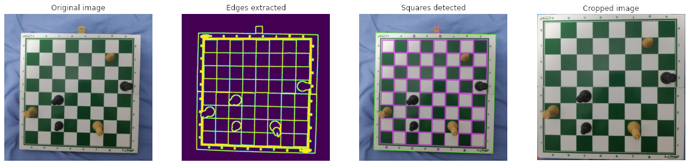

# Chess Board Recognition

Recognition of a chess board and pieces using image processing techniques such as enhancement, filtering and segmentation. Final project for Digital Image Processing course at USP - São Carlos. Our aim is to process the images and identify the pieces of the current match represented on the board.

## Contributors

- André Fakhoury
- Gustavo Soares

## Main objective

The main objective of this project is to recognise a chess position using a image of a chess board as input, utilising some techniques of Digital Image Processing and a Convolutional Neural Network. The chess position will be represented using the [Forsyth-Edwards Notation (FEN)](https://en.wikipedia.org/wiki/Forsyth%E2%80%93Edwards_Notation).

## Input dataset

The dataset is a mix of existent photos from [online repositories (thanks, guys!)](https://github.com/samryan18/chess-dataset) and photos of a physical chessboard and chess pieces taken by us. They consist of a upper view of a chessboard, and the filenames are the FEN of the current position. Here is an example of a picture taken by us:

The filename of this image is `8-6P1-8-7r-2k5-R7-2p2K2-8.png`, which corresponds to the FEN of the current position. Note that the slashes are replaced to hyphens, as slashes are not allowed in filenames. Also, there is no information about whose turn it is (white or black to play) and the final score of the match (because there is no way of discovering it by just looking at the image).

## Description of methods used

The image preprocessing is done using OpenCV and Numpy. Basically, the pipeline for this project is:

#### 1. Read the image
First of all, the image is read (using the library imageio).

#### 2. Process image to reduce noise
Now, some transformations are applied to the image, it is converted to grayscale, a Gaussian Blur to reduce the noise is applied and then the Canny method is used to detect the edges of the figure. After that, a morphological operation of Dilation is done to fill some gaps on the edges.

Then, we utilize the findContours method from OpenCV to find the coordinates of the image borders. Now, as the chessboard can be seen as a regular polygon, we apply the approxPolyDP to approximate every contour to another closed shape, consisting of a smaller number of vertices.

#### 3. Locate the chessboard
With the contours extracted and minimized to a simpler shape, we can try to locate all the squares of the image - and then, it's expected that the chessboard is a  large square with several squares inside.

#### 4. Crop the image to fit the board
With the board correctly located, we can use its corners to delimit the image sides. It helps to ignore some extra noise and useless information that may exist outside the board, so the next step can be done easier.

Some processes of the pipeline can be seen in the following image:

#### 5. Analyse the pieces and their respective positions
In this step, we use a convolutional neural network to analyse the pieces on each cell of the board. The network takes as input a 512x512 image of the cropped chessboard and outputs the identified piece of each postion. The network identifies the piece type (king, queen, rook, knight, bishop, pawn or empty) with no color information (white or black).

